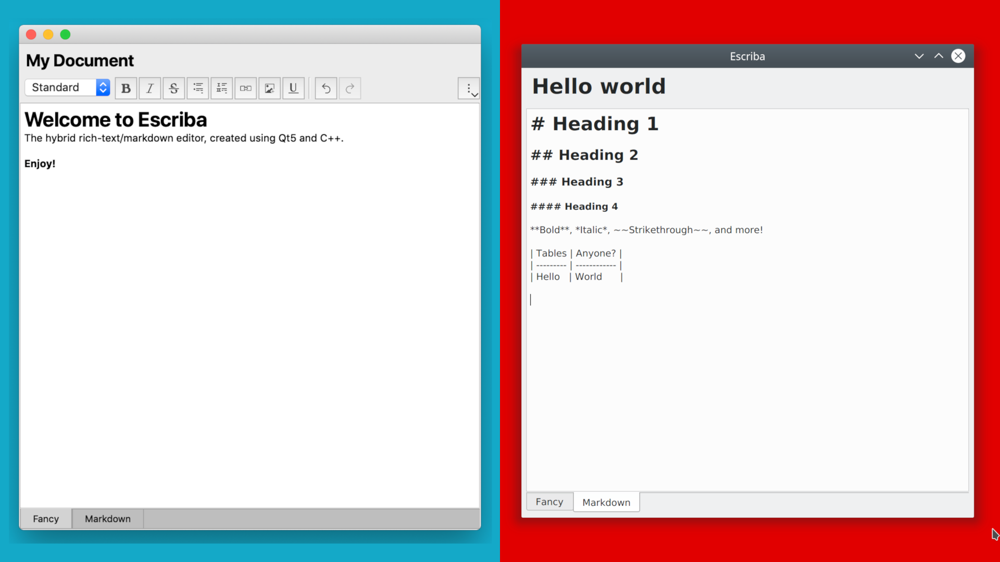

Escriba! The hybrid Rich/Markdown text editor used in Vibrato Notes
---

Escriba is an embedable rich-text/markdown text-editor availible for Linux, Mac, and (soon to come) Windows.

- `Escriba.pro` - include this file if you want to embed Escriba into your app.
- `Escriba-dev.pro` - This is an example project that is used for the development of Escriba. Check out `src/example.cpp` as an example of how to use Escriba.

**Windows Note**: I have yet to test out Windows support. Most likely the only changes needed will be in the QMake project file and/or the CMake of Markdownpanda, to configure library linking.

---

## Fork!

This project is forked from [MRichTextEditor](https://github.com/Anchakor/MRichTextEditor). Thank you for the nice starting point, Anchakor.

Check out CHANGES.txt to see the changes made to the original MRichTextEditor.
